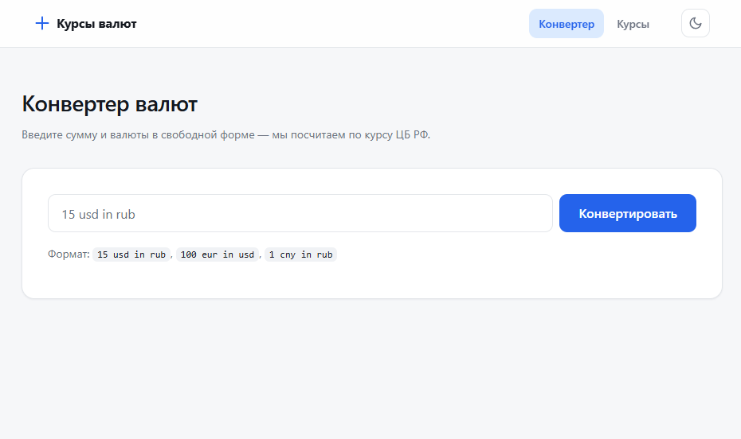
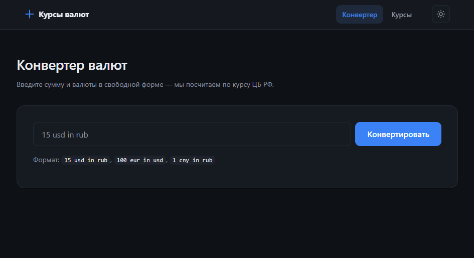

# Currency Converter

Приложение для конвертации валют по курсам Центрального банка РФ.
Две страницы: конвертер со свободным вводом и таблица актуальных курсов
относительно выбранной базовой валюты.

## Возможности

- **Конвертер** — ввод в свободной форме: `15 usd in rub`, `100 eur in usd`, `1 cny in rub`
- **Курсы валют** — таблица курсов относительно базовой валюты
- **Базовая валюта** — определяется автоматически по языку браузера, меняется вручную, сохраняется в `localStorage`
- **Тёмная / светлая тема** — с автоопределением системной темы и ручным переключением
- **Кэширование** — данные ЦБ кэшируются на 30 минут, повторные запросы мгновенны
- **Адаптивный интерфейс** — работает на мобильных и десктопе

## Стек

| Технология | Назначение |
|---|---|
| React 19 | UI |
| TypeScript | Типизация |
| Vite 8 (Rolldown) | Сборка и dev-сервер |
| React Router 7 | Маршрутизация |
| Vitest + Testing Library | Тесты |
| ESLint 9 | Линтинг |

## Быстрый старт

### Требования

- Node.js 20 или выше
- npm 10 или выше

### Установка

```bash
git clone <repo-url>
cd currency_converter
npm install
```

### Запуск в режиме разработки

```bash
npm run dev
```

Приложение откроется на `http://localhost:5173`.

### Сборка и предпросмотр

```bash
npm run build
npm run preview
```

Собранные файлы попадают в `dist/`.

## Команды

| Команда | Что делает |
|---|---|
| `npm run dev` | Запускает dev-сервер с HMR |
| `npm run build` | Собирает продакшн-бандл в `dist/` |
| `npm run preview` | Локальный предпросмотр собранного приложения |
| `npm run lint` | Проверяет код через ESLint |
| `npm test` | Запускает тесты в watch-режиме |
| `npm run test:run` | Запускает тесты один раз (для CI) |

## Структура проекта

```
currency_converter/
├── public/
│   ├── favicon.svg
│   └── icons.svg
├── src/
│   ├── components/          # Переиспользуемые UI-компоненты
│   │   ├── BaseCurrencySelect.tsx
│   │   ├── ConverterForm.tsx
│   │   ├── NavBar.tsx
│   │   ├── RatesTable.tsx
│   │   ├── SkeletonTable.tsx
│   │   ├── Spinner.tsx
│   │   └── ThemeToggle.tsx
│   ├── hooks/
│   │   ├── useBaseCurrency.ts
│   │   └── useTheme.ts
│   ├── pages/
│   │   ├── ConverterPage.tsx
│   │   └── RatesPage.tsx
│   ├── services/
│   │   └── cbrService.ts     # Загрузка и кэш курсов ЦБ
│   ├── styles/
│   │   ├── tokens.css        # CSS-переменные
│   │   ├── base.css          # Reset + типографика
│   │   └── components.css    # Стили компонентов
│   ├── utils/
│   │   ├── formatNumber.ts
│   │   └── parseInput.ts     # Парсер "15 usd in rub"
│   ├── App.tsx
│   ├── index.css
│   └── main.tsx
├── .gitignore
├── eslint.config.js
├── index.html
├── package.json
├── tsconfig.json
├── vite.config.ts
└── README.md
```

## Как это работает

### Парсинг ввода

Строка `15 usd in rub` разбирается регулярным выражением:

```
^(\d+(?:\.\d+)?)\s+([a-zA-Z]{3})\s+in\s+([a-zA-Z]{3})$
```

Результат — объект `{ amount: 15, from: 'USD', to: 'RUB' }`.
Регистр не важен, поддерживаются дробные суммы (`2.5 eur in rub`).

### Конвертация

Все курсы приводятся к рублю, затем пересчитываются в целевую валюту:

```ts
amountInRub = amount * rateFromToRub;
result      = amountInRub / rateToRub;
```

Такой подход универсален: не важно, какие именно валюты выбраны,
промежуточная база — рубль.

### Источник данных

Используется `https://www.cbr-xml-daily.ru/daily_json.js` —
JSON-прокси над сервисом ЦБ РФ. Он обновляется раз в сутки и не
требует SOAP и обхода CORS, в отличие от официального
`cbr.ru/DailyInfoWebServ/DailyInfo.asmx`.

Данные кэшируются в памяти на 30 минут. Курсы ЦБ меняются раз в сутки,
так что этот TTL с запасом покрывает любые сценарии.

## Тесты

Тесты написаны на Vitest + React Testing Library.

```bash
npm run test:run
```

Покрыты:
- парсер пользовательского ввода (`parseInput`)
- форматирование чисел (`formatNumber`)

Конфигурация — в `vite.config.ts` (секция `test`), общий setup-файл —
`src/test/setup.ts`.

## Доступность

- Семантическая разметка (`nav`, `main`, `header`, `table`)
- `aria-label` на полях ввода и кнопках
- `aria-invalid` на невалидном поле
- `role="alert"` для ошибок, `role="status"` для результата
- Видимый фокус через `:focus-visible`
- Уважение к `prefers-reduced-motion`

## Скриншоты

| Светлая тема |



| Тёмная тема |



## Известные ограничения

- Курсы ЦБ обновляются раз в сутки (обычно около 11:30 МСК). Внутри дня
  данные не меняются, поэтому 30-минутный кэш — не проблема.
- Прокси `cbr-xml-daily.ru` — сторонний сервис. Если он недоступен,
  приложение покажет ошибку; для продакшна стоит поднять собственный
  прокси над официальным API ЦБ.
- Нет офлайн-режима: при отсутствии сети данные не загрузятся.
- Валюты, которых нет в списке ЦБ (например, криптовалюты), не
  поддерживаются.

## Возможные улучшения

- [ ] История последних конвертаций (localStorage)
- [ ] Инверсия валют по клику (`15 usd in rub` → `15 rub in usd`)
- [ ] График динамики курса за месяц
- [ ] Поддержка сокращений (`usd` → `$`, `eur` → `€`)
- [ ] PWA-режим с офлайн-кэшем
- [ ] E2E-тесты через Playwright

## Лицензия

MIT